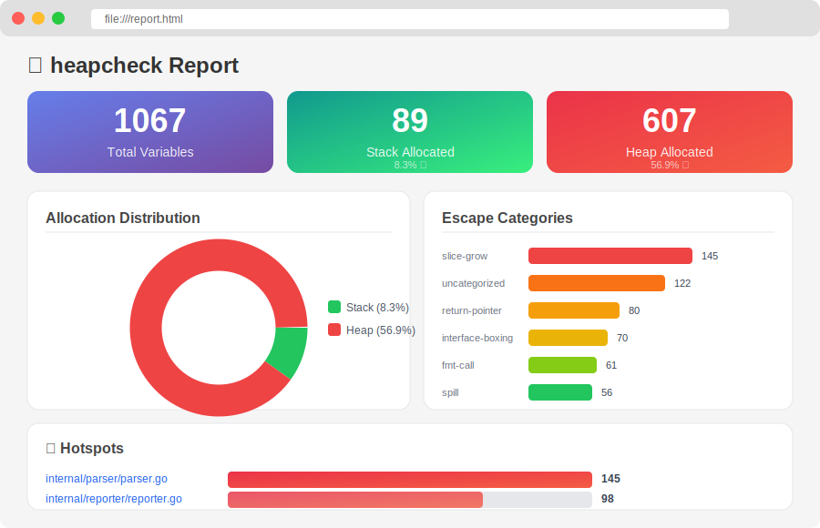

# heapcheck

[](https://github.com/harshakonda/heapcheck/actions/workflows/ci.yml)
[](https://pkg.go.dev/github.com/harshakonda/heapcheck)
[](https://goreportcard.com/report/github.com/harshakonda/heapcheck)
[](https://opensource.org/licenses/MIT)

**heapcheck** is a developer-friendly CLI tool that transforms Go's cryptic escape analysis output into human-readable reports with actionable optimization suggestions.

<p align="center">
  
</p>

## 🎯 Why heapcheck?

Go's compiler escape analysis is powerful but cryptic:

```bash
$ go build -gcflags="-m" ./...
./main.go:15:6: can inline square
./main.go:12:2: moved to heap: z
./main.go:8:14: *y escapes to heap
./main.go:11:13: x does not escape
```

**What does this mean? Why did `z` move to heap? How do I fix it?**

### With heapcheck:

```bash
$ heapcheck ./...

📊 heapcheck - Escape Analysis Report
──────────────────────────────────────────────────

Summary:
  Total variables analyzed: 847
  Stack allocated:          792 (93.5%) ✅
  Heap allocated:            55 (6.5%) ⚠️
  Inlined calls:            156

Escape Causes:
  1. interface-boxing      23 (41.8%)  → Use concrete types or generics
  2. return-pointer        15 (27.3%)  → Return by value if struct ≤ 64 bytes
  3. closure-capture        9 (16.4%)  → Pass as parameter instead
  4. fmt-call               5 (9.1%)   → Use strconv in hot paths
  5. slice-grow             3 (5.5%)   → Pre-allocate capacity

Hotspots (files with most escapes):
  pkg/server/handler.go                      12 escapes
  pkg/cache/store.go                          8 escapes
  internal/util/strings.go                    6 escapes

Run with -v for detailed breakdown of all 55 escapes.
```

## 🔬 For Researchers

**heapcheck** is designed to be fully citable research software.  
If you use this tool in academic work, scientific publications, or technical reports, please cite the archived Zenodo release using the DOI below.

[](https://doi.org/10.5281/zenodo.17895742)

### 📄 How to Cite

**Konda, S. H. (2025). _heapcheck: Human-Friendly Go Escape Analysis CLI_ (Version 0.1.3). Zenodo. https://doi.org/10.5281/zenodo.17895742**

### BibTeX

```bibtex
@software{konda2025heapcheck,
  author       = {Konda, Sri Harsha},
  title        = {heapcheck: Human-Friendly Go Escape Analysis CLI},
  year         = {2025},
  publisher    = {Zenodo},
  version      = {0.1.3},
  doi          = {10.5281/zenodo.17895742},
  url          = {https://doi.org/10.5281/zenodo.17895742}
}
```

## 📦 Installation

```bash
go install github.com/harshakonda/heapcheck/cmd/heapcheck@latest
```

Verify installation:
```bash
heapcheck --version
# heapcheck version 0.1.0
```

## 🚀 Quick Start

### Step 1: Analyze Your Project

```bash
cd your-go-project
heapcheck ./...
```

### Step 2: Get Detailed Report

```bash
# Verbose mode - see every escape with suggestions
heapcheck -v ./...
```

### Step 3: Generate Visual HTML Report

```bash
heapcheck --format=html ./... > report.html
open report.html  # or xdg-open on Linux
```

---

## 📊 Output Formats

heapcheck supports 4 output formats for different use cases:

### 1. Text (Default) - Human Readable

```bash
heapcheck ./...
```

Best for: Quick analysis, terminal usage

### 2. JSON - Machine Readable

```bash
heapcheck --format=json ./... > report.json
```

<details>
<summary>📋 Example JSON output</summary>

```json
{
  "summary": {
    "total": 847,
    "stackAllocated": 792,
    "heapAllocated": 55,
    "inlinedCalls": 156
  },
  "byCategory": {
    "interface-boxing": 23,
    "return-pointer": 15,
    "closure-capture": 9,
    "fmt-call": 5,
    "slice-grow": 3
  },
  "escapes": [
    {
      "file": "pkg/server/handler.go",
      "line": 45,
      "column": 12,
      "variable": "req",
      "category": "interface-boxing",
      "reason": "req escapes to heap",
      "suggestion": {
        "short": "Use concrete types in hot paths",
        "details": "Assigning to interface{} causes heap allocation..."
      }
    }
  ]
}
```

</details>

Best for: CI/CD pipelines, custom tooling, data analysis

### 3. HTML - Visual Report

```bash
heapcheck --format=html ./... > report.html
```

<p align="center">
  
</p>

Features:
- 📈 Summary statistics with visual indicators
- 🔍 Sortable table of all escapes
- 📁 File-by-file breakdown with line numbers
- 💡 Inline optimization suggestions
- 🎨 Clean, printable design

Best for: Code reviews, sharing with team, documentation

### 4. SARIF - GitHub Code Scanning

```bash
heapcheck --format=sarif ./... > results.sarif
```

Best for: GitHub Security tab integration, PR annotations

---

## 🔬 Step-by-Step Workflows

### Workflow 1: Finding Memory Hotspots

```bash
# Step 1: Get overview
heapcheck ./...

# Step 2: Focus on worst file
heapcheck --filter=pkg/server ./...

# Step 3: Get details for that file
heapcheck -v --filter=pkg/server/handler.go ./...

# Step 4: Generate report for team review
heapcheck --format=html --filter=pkg/server ./... > server-escapes.html
```

### Workflow 2: CI/CD Integration

```bash
# In your CI pipeline:

# Step 1: Run analysis
heapcheck --format=json ./... > heapcheck.json

# Step 2: Check escape count threshold
ESCAPES=$(jq '.summary.heapAllocated' heapcheck.json)
if [ "$ESCAPES" -gt 100 ]; then
  echo "❌ Too many heap escapes: $ESCAPES"
  exit 1
fi

# Step 3: Upload SARIF for GitHub annotations
heapcheck --format=sarif ./... > results.sarif
```

### Workflow 3: Before/After Optimization

```bash
# Before optimization
heapcheck --format=json ./... > before.json

# Make your changes...

# After optimization
heapcheck --format=json ./... > after.json

# Compare
echo "Before: $(jq '.summary.heapAllocated' before.json) escapes"
echo "After:  $(jq '.summary.heapAllocated' after.json) escapes"
```

---

## 📂 Real-World Examples

See the [`examples/`](examples/) directory for tested projects:

| Example | Description | What You'll Learn |
|---------|-------------|-------------------|
| [basic-patterns](examples/basic-patterns/) | Common escape patterns | All escape categories demonstrated |
| [http-server](examples/http-server/) | HTTP API server | Interface boxing in handlers |
| [worker-pool](examples/worker-pool/) | Concurrent workers | Closure captures in goroutines |
| [json-processor](examples/json-processor/) | JSON processing | Slice growth, reflection |

### Running Examples

```bash
# Analyze basic patterns
cd examples/basic-patterns
heapcheck ./...
heapcheck -v ./...  # detailed view

# Generate HTML report
heapcheck --format=html ./... > report.html
open report.html
```

---

## 🏷️ Escape Categories

heapcheck categorizes escapes into 19 categories with actionable suggestions:

| Category | Description | Suggestion | Impact |
|----------|-------------|------------|--------|
| `return-pointer` | Returns `&localVar` | Return by value if ≤64 bytes | 🔴 High |
| `interface-boxing` | Assigned to `interface{}` | Use generics (Go 1.18+) | 🔴 High |
| `closure-capture` | Captured by closure | Pass as parameter | 🔴 High |
| `goroutine-escape` | Passed to goroutine | Use worker pools | 🟡 Medium |
| `channel-send` | Sent over channel | Consider sync.Pool | 🟡 Medium |
| `slice-grow` | Slice append/growth | Pre-allocate capacity | 🟡 Medium |
| `fmt-call` | Used in fmt.Printf etc | Use strconv in hot paths | 🟡 Medium |
| `map-allocation` | `make(map[K]V)` | Maps always heap allocate | 🟢 Low |
| `unknown-size` | `make([]T, n)` variable n | Use fixed arrays if possible | 🟢 Low |
| `reflection` | Uses reflect package | Avoid in hot paths | 🔴 High |

<details>
<summary>📋 See all 19 categories</summary>

| Category | Description |
|----------|-------------|
| `return-pointer` | Returning pointer to local variable |
| `interface-boxing` | Assigning to interface{} |
| `closure-capture` | Variable captured by closure |
| `goroutine-escape` | Passed to goroutine |
| `channel-send` | Sent on channel |
| `slice-grow` | Slice may grow via append |
| `unknown-size` | Size unknown at compile time |
| `too-large` | Struct too large for stack |
| `fmt-call` | Passed to fmt functions |
| `reflection` | Uses reflect package |
| `leaking-param` | Parameter escapes function |
| `string-conversion` | string([]byte) conversion |
| `spill` | Compiler spilled to heap |
| `assignment` | Assigned to escaping location |
| `call-parameter` | Escapes via function call |
| `map-allocation` | make(map[K]V) |
| `new-allocation` | new(T) |
| `composite-literal` | &Struct{} literal |
| `uncategorized` | Couldn't determine reason |

</details>

---

## 🔧 Common Escape Patterns & Fixes

### Pattern 1: Returning Pointers

```go
// ❌ ESCAPES - pointer to local variable
func newUser() *User {
    u := User{Name: "test"}
    return &u  // moved to heap!
}

// ✅ NO ESCAPE - return by value (for small structs)
func newUser() User {
    return User{Name: "test"}  // stays on stack
}

// ✅ NO ESCAPE - caller provides storage
func initUser(u *User) {
    u.Name = "test"  // caller controls allocation
}
```

**heapcheck output:**
```
pkg/user.go:12:9 return-pointer
  Variable: u
  Suggestion: Return by value if struct size ≤ 64 bytes
```

### Pattern 2: Interface Boxing

```go
// ❌ ESCAPES - interface boxing
func process(items []Item) {
    for _, item := range items {
        fmt.Println(item)  // item boxed to interface{}
    }
}

// ✅ NO ESCAPE - use concrete types
func process(items []Item) {
    for _, item := range items {
        log.Print(item.String())  // no boxing
    }
}

// ✅ NO ESCAPE - use generics (Go 1.18+)
func process[T fmt.Stringer](items []T) {
    for _, item := range items {
        _ = item.String()  // no boxing
    }
}
```

### Pattern 3: Closure Captures

```go
// ❌ ESCAPES - closure captures variable
func processAll(items []Item) {
    for _, item := range items {
        go func() {
            handle(item)  // item escapes!
        }()
    }
}

// ✅ NO ESCAPE - pass as parameter
func processAll(items []Item) {
    for _, item := range items {
        go func(it Item) {
            handle(it)  // parameter, no escape
        }(item)
    }
}
```

### Pattern 4: Slice Pre-allocation

```go
// ❌ MAY ESCAPE - slice grows unpredictably
func collect(n int) []Result {
    var results []Result
    for i := 0; i < n; i++ {
        results = append(results, process(i))
    }
    return results
}

// ✅ BETTER - pre-allocate capacity
func collect(n int) []Result {
    results := make([]Result, 0, n)  // known capacity
    for i := 0; i < n; i++ {
        results = append(results, process(i))
    }
    return results
}
```

### Pattern 5: fmt vs strconv

```go
// ❌ ESCAPES - fmt causes interface boxing
func formatID(id int) string {
    return fmt.Sprintf("%d", id)  // boxing!
}

// ✅ NO ESCAPE - strconv is allocation-free
func formatID(id int) string {
    return strconv.Itoa(id)  // no boxing
}
```

---

## 🔄 CI/CD Integration

### GitHub Actions

```yaml
name: Escape Analysis
on: [push, pull_request]

jobs:
  heapcheck:
    runs-on: ubuntu-latest
    steps:
      - uses: actions/checkout@v4
      
      - name: Setup Go
        uses: actions/setup-go@v5
        with:
          go-version: '1.22'
      
      - name: Install heapcheck
        run: go install github.com/harshakonda/heapcheck/cmd/heapcheck@latest
      
      - name: Run Analysis
        run: |
          heapcheck ./... 
          heapcheck --format=sarif ./... > results.sarif
      
      - name: Upload SARIF
        uses: github/codeql-action/upload-sarif@v3
        with:
          sarif_file: results.sarif
      
      - name: Check Threshold
        run: |
          ESCAPES=$(heapcheck --format=json ./... | jq '.summary.heapAllocated')
          echo "Heap escapes: $ESCAPES"
          if [ "$ESCAPES" -gt 100 ]; then
            echo "::error::Too many heap escapes!"
            exit 1
          fi
```

### GitLab CI

```yaml
heapcheck:
  stage: lint
  image: golang:1.22
  script:
    - go install github.com/harshakonda/heapcheck/cmd/heapcheck@latest
    - heapcheck ./...
    - heapcheck --format=json ./... > heapcheck.json
  artifacts:
    paths:
      - heapcheck.json
```

### Pre-commit Hook

```bash
#!/bin/bash
# Save as .git/hooks/pre-commit and chmod +x

echo "🔍 Running heapcheck..."
heapcheck ./...

ESCAPES=$(heapcheck --format=json ./... | jq '.summary.heapAllocated')
if [ "$ESCAPES" -gt 50 ]; then
    echo "⚠️  Warning: $ESCAPES heap escapes detected"
fi
```

---

## 📚 Understanding Escape Analysis

### Why Does It Matter?

| Allocation Type | Speed | GC Impact | When Freed |
|-----------------|-------|-----------|------------|
| **Stack** | ~1 ns | None | Function return |
| **Heap** | ~25 ns | GC overhead | When unreachable |

**In hot paths, heap allocations can:**
- ⏱️ Increase latency by 25x per allocation
- 🛑 Cause GC pauses (stop-the-world)
- 🧩 Fragment memory
- 📉 Reduce cache efficiency

### When to Optimize?

```
                ┌─────────────────────────────────┐
                │   Should I optimize this?       │
                └─────────────────────────────────┘
                               │
                               ▼
                ┌─────────────────────────────────┐
                │  Is it in a hot path?           │
                │  (called frequently)            │
                └─────────────────────────────────┘
                      │                    │
                     YES                   NO
                      │                    │
                      ▼                    ▼
         ┌─────────────────────┐   ┌─────────────────┐
         │ Profile first!      │   │ Don't optimize  │
         │ Use pprof to        │   │ (premature      │
         │ confirm it matters  │   │  optimization)  │
         └─────────────────────┘   └─────────────────┘
                      │
                      ▼
         ┌─────────────────────┐
         │ Use heapcheck to    │
         │ identify escapes    │
         │ Apply fix patterns  │
         └─────────────────────┘
```

### Recommended Optimization Workflow

1. **Benchmark first**: `go test -bench=. -benchmem`
2. **Profile**: `go tool pprof`  
3. **Identify escapes**: `heapcheck -v ./...`
4. **Fix patterns**: Apply suggestions from heapcheck
5. **Verify improvement**: Re-benchmark

---

## 🧪 Try It Out

### Self-Analysis

```bash
# heapcheck analyzing itself!
git clone https://github.com/harshakonda/heapcheck
cd heapcheck
go build -o heapcheck ./cmd/heapcheck
./heapcheck ./...
```

### Analyze Popular Projects

```bash
# Analyze gin web framework
git clone https://github.com/gin-gonic/gin /tmp/gin
heapcheck /tmp/gin/...

# Analyze cobra CLI library
git clone https://github.com/spf13/cobra /tmp/cobra
heapcheck /tmp/cobra/...
```

---

## 🤝 Contributing

Contributions are welcome! See [CONTRIBUTING.md](CONTRIBUTING.md) for guidelines.

### Development Setup

```bash
git clone https://github.com/harshakonda/heapcheck
cd heapcheck
go test ./...
go build -o heapcheck ./cmd/heapcheck
./heapcheck ./...
```

### Areas for Contribution

- 🎨 Improve HTML report visualizations
- 📊 Add more escape categories  
- 🧪 Add example projects
- 📖 Documentation improvements
- 🐛 Bug fixes

---

## 📄 License

MIT License - see [LICENSE](LICENSE) for details.

---

## 🔗 Related Resources

- [Go Escape Analysis FAQ](https://go.dev/doc/faq#stack_or_heap)
- [Understanding Allocations in Go](https://go.dev/blog/ismmkeynote)
- [pprof - Go Profiler](https://go.dev/blog/pprof)
- [staticcheck - Go Static Analysis](https://staticcheck.io/)

---

<p align="center">
  Made with ❤️ for the Go community<br>
  ⭐ Star this repo if you find it useful!
</p>
